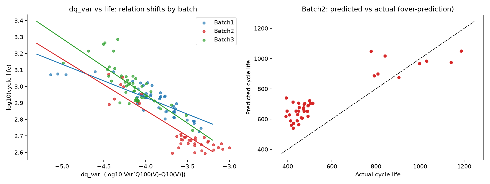

# ESS 배터리 수명(cycle life) 예측

> SKALA 울산캠퍼스 4반 · 데이터 분석 mini-Project (개인) · 배은빈

초기 100 사이클의 충·방전 데이터만으로 리튬이온 셀의 수명(cycle life)을 예측하고, 학습 배치(Batch1)에서 만든 모델이 다른 배치(Batch2, Batch3)에서도 통하는지 검증한다.

---

## 1. 프로젝트 개요

| 항목        | 내용                                                                                                     |
| ----------- | -------------------------------------------------------------------------------------------------------- |
| 문제        | 용량이 정격의 80%(EOL)에 도달하는 사이클 수(cycle_life)를 초기 100 사이클로 예측                         |
| 데이터      | MIT-Stanford(Severson et al., 2019) 3개 배치 (Kaggle `itshpark/data-driven-prediction-of-battery-cycle`) |
| 학습 / 평가 | Batch1 = 학습, **Batch2 = 최종 Test(1회 평가)**, Batch3 = 추가 일반화 확인                               |
| 유형        | 회귀 (타깃 = `log10(cycle_life)`)                                                                        |
| 사용 셀 수  | Batch1 46개, Batch2 39개, Batch3 44개 (수명이 NaN인 셀은 제외)                                           |
| 최종 모델   | Elastic Net, feature = `dq_var` 1개                                                                      |

**활용 의미**: 수명 시험에는 수개월이 걸린다. 초기 100 사이클로 수명을 예측하면 셀 선별, ESS 교체 시점 예측, 충전 정책 최적화를 앞당길 수 있다.

## 2. 파일 구조

```
ess-battery-project/
├── README.md
├── requirements.txt
├── data/README.md          # 데이터 출처 안내 (데이터 자체는 올리지 않음)
├── notebooks/
│   ├── 01_EDA.ipynb        # 탐색적 분석
│   └── 03_modeling.ipynb   # 분할 · 모델 비교 · 평가 · 오류 분석
├── src/
│   ├── features.py         # 셀 1개 -> feature 계산
│   ├── preprocess.py       # .mat 3개 -> data/features_all.csv
│   ├── split.py            # 정책 단위 Hold-out / GroupKFold
│   └── evaluate.py         # MAPE/MAE/RMSE, CV 평가
└── results/
    ├── model_performance.csv
    ├── model_performance_batch3.csv
    ├── model_comparison_batch1.csv
    ├── ablation_features.csv
    └── batch_shift.png
```

## 3. 실행 방법

```bash
git clone https://github.com/bae-bong/ess-battery-project.git
cd ess-battery-project
python3.11 -m venv .venv && source .venv/bin/activate
pip install -r requirements.txt

# data/ 폴더에 Kaggle 데이터(.mat 3개)를 넣는다 (data/README.md 참고)
python -m src.preprocess            # data/features_all.csv 생성
# 이후 notebooks/01_EDA.ipynb, 03_modeling.ipynb 를 순서대로 실행
```

- 환경: Python 3.11, scikit-learn 1.9.0, pandas 3.0.3, numpy 2.4.6 (전체는 `requirements.txt`)
- 난수 시드: 42 (정책 단위 Hold-out)
- `.mat` 로딩 시 `MATLAB type not supported: string` 로그가 나오지만 결과에 영향 없다.

## 4. EDA 핵심 발견

| 질문                      | 발견                                                                                                                                               | 설계 반영                                           |
| ------------------------- | -------------------------------------------------------------------------------------------------------------------------------------------------- | --------------------------------------------------- |
| 수명 분포                 | 배치마다 범위가 다름. 평균/중앙값/최소/최대/왜도: B1 844.7/858.5/534/1227/0.44, **B2 565.7/472.0/392/1186/1.57**, B3 1059.7/1005.5/541/1935/1.21   | 타깃 log10 변환, 외삽이 가능한 선형 모델을 기준으로 |
| 수명을 알아야 계산되는 값 | knee, 총 사이클 수는 data leakage                                                                                                                  | 입력에서 제외                                       |
| ΔQ(V)=Q100(V)−Q10(V)      | `dq_var`와 log(수명)의 상관이 가장 강함: B1 −0.846, B2 −0.905, B3 −0.787                                                                           | `dq_var`를 핵심 feature로                           |
| 충전 정책                 | 같은 정책 셀은 수명이 비슷하고 정책이 다르면 크게 다름. 충전 관련 feature의 상관 부호가 배치마다 바뀜(`chargetime_mean`: +0.727 / −0.934 / +0.594) | 정책 단위 분할, 보조 feature는 보조로만             |
| 다중공선성                | VIF: dq_var 158.2, dq_mean 115.2, dq_min 100.6, tavg_mean 28.8, tmax_mean 23.2, dq_kurt 14.4 …                                                     | 중복 그룹의 대표만 사용, 규제 모델                  |

## 5. 모델링 · Feature 전략

- **입력 구간**: 2~100 사이클만 사용 (1 사이클은 전부 0).
- **핵심**: `dq_var` = log10( Var[Q100(V) − Q10(V)] ).
- **보조 후보**: `c1`(첫 C-rate), `chargetime_mean`, `tavg_mean`, `qd_slope`.
- **제외**: dq_mean, dq_min(중복), tmax_mean(중복), dq_kurt, dq_skew, qd_2, ir_2, ir_diff, knee, 총 사이클 수.
- **Regression 선택 이유**: 실무 목적이 "몇 사이클 남았는가"이고, 분류는 임계값 설정 시 Batch1이 한 클래스로 몰린다.
- **전처리**: StandardScaler는 학습 데이터로만 fit (sklearn Pipeline).

### 데이터 분할

| 이름       | 데이터                                                | 용도                                                  |
| ---------- | ----------------------------------------------------- | ----------------------------------------------------- |
| Train (CV) | Batch1의 18개 정책, 35셀                              | 학습 + 정책 단위 5-fold GroupKFold                    |
| Valid      | Batch1의 5개 정책, 11셀 (정책 단위 Hold-out, seed 42) | 일반화 점검 (모델 선택에 사용하지 않음)               |
| Test       | Batch2 39셀                                           | 모델 확정 후 **1회** 평가 (Batch1 전체 46셀로 재학습) |
| 추가       | Batch3 44셀                                           | 추가 일반화 확인                                      |

같은 정책의 셀은 수명이 비슷하므로 셀 단위로 나누면 성능이 과대평가된다. 따라서 정책 단위로 분할했다.

### 지표

원 단위(사이클)로 환산한 **MAPE(주지표)**, MAE, RMSE. 논문 기준은 Regression MAPE 9.1%.

## 6. 모델 선택

**선택 기준(Batch2를 보기 전에 정함)**: Train(CV) MAPE가 가장 낮은 모델. 차이가 CV std 이내이면 더 단순한 모델. Valid는 선택에 사용하지 않는다.

| 모델                   | feature      | 설정            | Train(CV) MAPE | CV std | Valid MAPE |
| ---------------------- | ------------ | --------------- | -------------- | ------ | ---------- |
| 평균 예측 (기준선)     | -            | -               | 19.21          | 8.51   | 16.08      |
| **Elastic Net (최종)** | A (`dq_var`) | α=0.003, l1=0.1 | **7.23**       | 2.40   | 23.33      |
| 선형회귀               | A            | -               | 7.23           | 2.38   | 23.57      |
| Ridge                  | A            | α=1             | 7.30           | 2.41   | 22.52      |
| Elastic Net            | B (5개)      | α=0.01, l1=0.5  | 7.73           | 2.36   | 21.02      |
| Ridge                  | B            | α=10            | 8.84           | 2.44   | 15.68      |
| Gradient Boosting      | A            | depth 2         | 9.39           | 1.95   | 7.81       |
| 선형회귀               | B            | -               | 9.40           | 2.09   | 22.76      |
| Random Forest          | A            | depth 3         | 9.88           | 4.22   | 10.67      |
| Random Forest          | B            | depth 3         | 10.22          | 5.10   | 9.19       |
| Gradient Boosting      | B            | depth 2         | 10.73          | 4.05   | 7.40       |

(A = `dq_var`, B = `dq_var, c1, chargetime_mean, tavg_mean, qd_slope`)

**선택 이유와 주의점**

- CV 기준으로 `dq_var` 단일 선형 계열이 가장 좋고, feature가 하나뿐이어서 Elastic Net(α=0.003)은 사실상 선형회귀와 동일하다. DAY 1 설계의 주력 모델이고 동점이므로 Elastic Net을 택했다.
- 트리 모델은 Valid가 7~10%로 좋았으나 CV는 나쁘고 변동이 크다. Valid의 큰 오차는 한 정책의 학습 범위 밖 외삽에서 나왔고, 트리는 학습 수명 범위(최대 1227)를 넘는 값을 예측하지 못하는 성질이 이 분할에서 우연히 유리했다. 점수를 본 뒤 선택 기준을 바꾸지 않았다.
- Ridge(B, α=10)의 Valid 15.68%는 예측이 평균 쪽으로 눌린 결과로, 평균 예측(16.08%)과 거의 같다.

### 추가 실험 (보조 feature ablation)

보조 feature 4개를 한꺼번에 넣었더니 CV가 개선되지 않아, `dq_var`에 하나씩 추가해 보았다. 채택 기준은 "CV가 1%p 이상 개선"이었다.

| 추가 feature      | Train(CV) | CV std | Valid | CV 변화(%p) |
| ----------------- | --------- | ------ | ----- | ----------- |
| (없음, 현재 모델) | 7.23      | 2.40   | 23.33 | 0.00        |
| + c1              | 7.31      | 2.50   | 23.44 | +0.08       |
| + chargetime_mean | 7.18      | 2.15   | 23.16 | −0.05       |
| + tavg_mean       | 7.44      | 2.27   | 23.28 | +0.21       |
| + qd_slope        | 8.44      | 2.23   | 22.73 | +1.21       |

채택 기준을 넘은 조합이 없어 `dq_var` 단독을 유지했다. `qd_slope`는 오히려 CV를 악화시켰다.

## 7. 성능 리포팅

### Batch1 → Batch2 (최종 모델: Elastic Net, `dq_var`)

| 구분                    | MAPE (%)   | 비고                           |
| ----------------------- | ---------- | ------------------------------ |
| Train (Batch1 CV)       | 7.23       | 5-fold, 정책 단위, std 2.40    |
| Valid (Batch1 Hold-out) | 23.33      | 5개 정책, 11셀                 |
| **Test (Batch2)**       | **36.67**  | MAE 177.5, RMSE 189.7 사이클   |
| Gap (Train → Valid)     | **+16.10** | (+) 과적합 의심                |
| Gap (Valid → Test)      | **+13.34** | (+) 배치 일반화 저하           |
| Gap (Target → Test)     | **+27.57** | 논문 Regression MAPE 9.1% 대비 |

참고(최종 모델 선택에 사용하지 않음): Batch2 Test MAPE는 평균 예측 67.09%, Gradient Boosting(A) 33.29%였다. 최종 모델이 평균 예측보다 오차가 거의 절반이고, Gradient Boosting이 3.4%p 더 낫지만 선택 기준을 사후에 바꾸지 않았다.

### 추가: Batch3

| Batch2 MAPE | Batch3 MAPE | Gap (Batch2 → Batch3) | Batch3 MAE |
| ----------- | ----------- | --------------------- | ---------- |
| 36.67       | 13.56       | −23.11                | 170.45     |

Batch3의 MAPE는 낮지만 MAE는 170 사이클로 Batch2(178)와 비슷하다. Batch3는 수명이 길어(중앙값 약 1005) 같은 절대 오차가 MAPE로는 작게 나타난다.

## 8. 오류 분석

### 8-1. Valid (Batch1 Hold-out)

선형회귀(`dq_var`)의 Valid MAPE는 23.57%였고, 큰 오차는 **한 정책에서** 나왔다.

| cell_id | 정책           | dq_var | 실제 | 예측 | 오차   |
| ------- | -------------- | ------ | ---- | ---- | ------ |
| 1       | 3.6C(80%)-3.6C | −5.14  | 1179 | 1983 | +68.2% |
| 0       | 3.6C(80%)-3.6C | −5.05  | 1190 | 1871 | +57.2% |
| 2       | 3.6C(80%)-3.6C | −4.95  | 1177 | 1746 | +48.3% |

- 이 3셀이 11셀 전체 오차 합의 약 67%를 차지하고, 나머지 8셀의 평균 오차는 약 10.7%이다(분석용 수치이며 보고 점수는 23.33%/23.57% 그대로).
- 세 셀의 `dq_var`가 Train 최솟값(−4.6)보다 작아 직선이 학습 범위 밖으로 뻗어 나갔다. 정책 단위 분할에서 수명이 가장 긴 정책이 통째로 Valid로 간 결과이다.

### 8-2. Test (Batch2)

- **상위 오차 10셀이 모두 과대 예측**(+47%~+88%): 실제 수명 392~477 사이클인 셀을 617~739로 예측했다.
- **체계적 편향**: 평균 로그 오차 +0.124, 즉 실제의 약 1.33배로 예측한다. 예측값은 약 540~1050으로 좁게 몰리고 실제는 392~1186으로 넓게 퍼진다(짧은 쪽은 과대, 가장 긴 쪽은 약간 과소).
- **배치별 dq_var–log(수명) 직선** (분석용): Batch1 `2.124 − 0.202·dq_var`(상관 −0.846), Batch2 `1.604 − 0.313·dq_var`(−0.905), Batch3 `1.577 − 0.343·dq_var`(−0.787). 어느 배치에서나 관계의 방향은 같으나 Batch1만 기울기가 완만하고 절편이 다르다. 같은 `dq_var`(약 −3.7)에서 Batch1 셀은 691~788, Batch2 셀은 393~449 사이클이었다.
- **외삽은 주원인이 아니다**: Batch2의 12개 셀(39셀 중)은 `dq_var`가 Batch1 최댓값(약 −3.34)을 넘어 학습 범위를 벗어난다. 그러나 범위 안 27셀의 MAPE는 36.7%, 범위 밖 12셀은 36.6%로 같아, 오차는 학습 범위를 벗어났기 때문이 아니라 배치 간 관계 이동(같은 `dq_var`에서 Batch2의 수명이 더 짧음) 때문이다.
- **순위 정보**: Batch2 전체에서 Spearman −0.72(방향 유지), 수명 600 미만 30셀 안에서는 −0.40으로 약하다. 장수/단수명을 가르는 큰 방향은 유지되나 단수명 구간 내부의 세부 예측력은 제한적이다.



_왼쪽: Batch별 dq_var–log(수명)과 직선. 오른쪽: Batch2 예측 대 실제(점선 위 = 과대 예측)._

## 9. ESS 도메인 해석

1. **조기 선별과 교체 계획**: 초기 100 사이클의 `dq_var` 하나로 수명 순위의 큰 방향을 알 수 있다는 것은, 수개월 걸리는 수명 시험 없이 셀 수준에서 불량·장수 후보를 조기 선별하는 데 쓸 수 있음을 뜻한다. 같은 배치 안에서는 CV MAPE 7.2%로 실용 가능한 수준이다.
2. **`dq_var`의 의미**: ΔQ(V)의 분산이 크다는 것은 전압 구간별 용량 변화가 크다, 즉 초기부터 열화가 빠르게 진행 중이라는 신호로 해석된다(논문의 설명을 따른 해석이며, 이 프로젝트에서 물리 메커니즘을 직접 검증한 것은 아니다).
3. **배치 간 이동의 의미**: 같은 `dq_var`에서도 배치에 따라 수명이 다르다는 것은 셀 제조 로트·공정이나 시험 조건이 바뀌면 예측식이 달라질 수 있음을 시사한다(원인은 이 데이터만으로 확정할 수 없음). 실무에서는 새 배치마다 소수의 셀로 재보정하는 절차가 필요하다.
4. **오차의 방향이 중요하다**: Batch2에서 모델은 수명을 **길게** 예측하는 쪽으로 틀렸다. ESS 운영에서는 실제 수명보다 길게 예측하면 교체 시점이 늦어져 가용성과 안전 측면의 위험이 커진다. 새 배치에 그대로 적용할 때는 보수적인 하한(예: 예측값에 안전 계수)을 두어야 한다.
5. **충전 정책**: 정책에 따라 수명이 크게 다르다는 EDA 결과는 충전 정책 최적화의 여지를 보여 주지만, 이번 ablation에서 `c1` 등 충전 관련 feature는 `dq_var` 이상의 예측력을 더하지 못했다.

## 10. 한계와 향후 과제

**한계**

- 셀 수가 적다(학습 35셀, Valid 11셀/5정책). Valid 점수는 정책 하나에 크게 좌우되어 불안정하다. 시드 하나(42)만 사용했다.
- 단일 배치(Batch1)로만 학습해 배치 간 이동을 흡수하지 못했다. Test MAPE 36.67%는 논문 기준(9.1%)에 크게 못 미친다.
- Valid에는 수명이 짧은 셀(<691)이 없어 단수명 구간의 검증이 부족하다.
- 배치별 직선 분석과 Batch3 평가는 Test 정답을 이용한 사후 분석이며 모델 선택에 사용하지 않았다.
- cycle_life 레이블 정의의 일관성(일부 Batch1 셀의 마지막 기록 용량이 0.88 Ah보다 훨씬 큼)은 추가 확인이 필요하다.

**향후 과제**

- 새 배치의 일부 셀로 재보정(offset/기울기 보정) 후 나머지 셀로 평가
- Batch1+2로 학습해 Batch3에 적용하는 다배치 학습
- 예측 구간(불확실성) 제공, 논문의 추가 feature 및 곡선 기반 feature 검토

## 11. 참고문헌

- Severson, K. A. et al. _Data-driven prediction of battery cycle life before capacity degradation._ Nature Energy 4, 383–391 (2019).
- Kaggle dataset: `itshpark/data-driven-prediction-of-battery-cycle`

## 12. 팀

개인 프로젝트: 배은빈 (SKALA 울산캠퍼스 4반)
